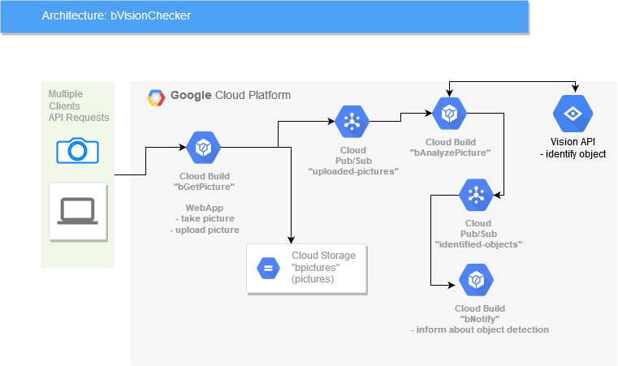

# bVisionCheck

Python application which allows to identify "object" on the picture and send notification to power user of the application. The application is created to inform me about my dog Bono waiting next to the door but it can be used also to identify other type of objects.

The application uses Google native services like:
- GCR
- Cloud Storage
- Pub/Sub
- Cloud Run

## Application architecture

## Installation

1. Create project in GCP
2. Create Cloud Storage for storing pictures

    `gsutil mb -c standard -l europe-west3  gs://bpictures`

3. Activate GCR API

    **Authenticate to Container Registry**

    `gcloud auth configure-docker`

4. Activate Vision API

    `gcloud services enable vision.googleapis.com`

## Others

### Configuration of credentials when you test and develop application locally
1. Create service account
2. Configure local environment variable

`export GOOGLE_APPLICATION_CREDENTIALS="/path/to/keyfile.json"`

## Microservice gGetPicture

This microservice is used to upload picture to Cloud Storage and send message to Pub/Sub topic.

**Environemnt variables:**
- SECRET_KEY 
- PROJECT_ID 
- TOPIC_NAME 
- STORAGE_BUCKET_NAME 

**Build of docker image**

    docker build -t eu.gcr.io/<your-project-id>/bgetpicture:v0.1 .

    docker push eu.gcr.io/<your-project-id>/bgetpicture:v0.1

**Create Cloud Run instance**

gcloud run deploy --image eu.gcr.io/<your-project-id>/bgetpicture:<tag> --platform managed --region europe-west1 --max-instances 2 --service-account <service-account-name> --allow-unauthenticated --set-env-vars PROJECT_ID=<project-id>,STORAGE_BUCKET_NAME=<cloud-storage-name>,TOPIC_NAME=<pub-sub-topic-name>  bgetpicture

## Change logs

### 0.0.1 initial configuration
- README updated
- Application architecture diagram

### 0.1 (11/25/2019) created bGetPicture microservice
- created first microservice and configuration file (bGetPicture v.0.1)

### 0.2 (11/26/2019) created draft of bAnalyzePicture
- created draft of bAnalyzePicture microservice
  - connected to Vision AI
  - connected to Cloud Storage
  - connected to output Pub/Sub
- created supporitgn service bListener
 - microservice is connected to Stackdriver logs and is used to support development and tests

